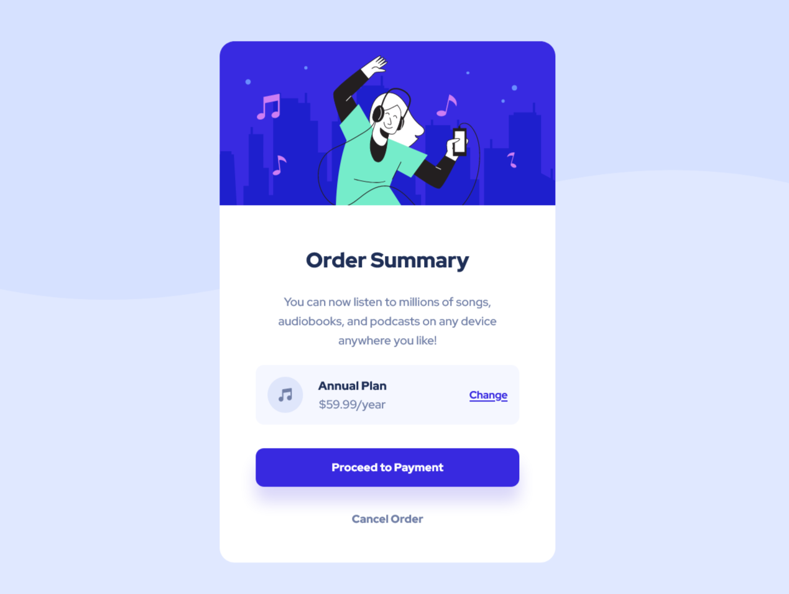

# Frontend Mentor - Order summary card solution

This is a solution to the [Order summary card challenge on Frontend Mentor](https://www.frontendmentor.io/challenges/order-summary-component-QlPmajDUj). Frontend Mentor challenges help you improve your coding skills by building realistic projects.

## Table of contents

- [Overview](#overview)
  - [The challenge](#the-challenge)
  - [Screenshot](#screenshot)
  - [Links](#links)
- [My process](#my-process)
  - [Built with](#built-with)
  - [Author](#author)

## Overview

### The challenge

Users should be able to:

- See hover states for interactive elements

### Screenshot

#### Desktop View

#### Mobile View

### Links

- Solution URL: [https://github.com/SauravFrontendDev/Order_summary_card](https://github.com/SauravFrontendDev/Order_summary_card)
- Live Site URL: [https://fem-saurav-order-summary.netlify.app/](https://fem-saurav-order-summary.netlify.app/)

### Built with

- Semantic HTML5 markup
- CSS custom properties
- Flexbox
- Mobile-first workflow
- Vite

## Author

- Github - [SauravFrontendDev](https://github.com/SauravFrontendDev)

- Linkedin - [/in/saurav-dev/](https://www.linkedin.com/in/saurav-dev/)

- Frontend Mentor - [@Saurav-98](https://www.frontendmentor.io/profile/Saurav-98)

- Twitter - [@SauravKverma22](https://twitter.com/SauravKverma22)
